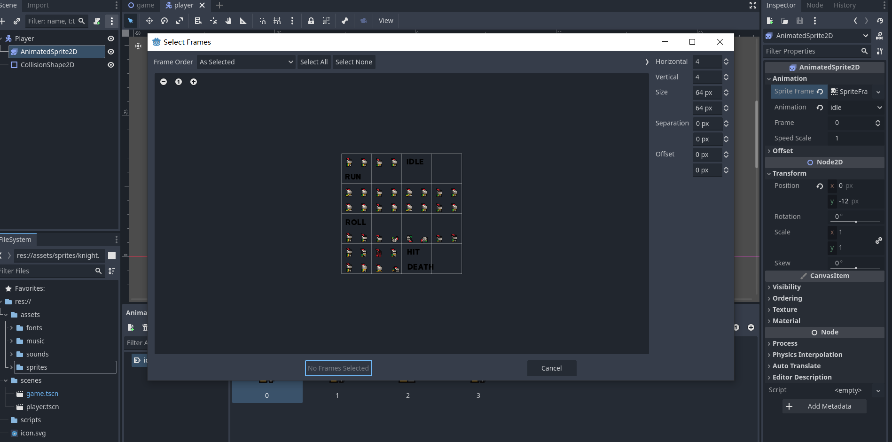
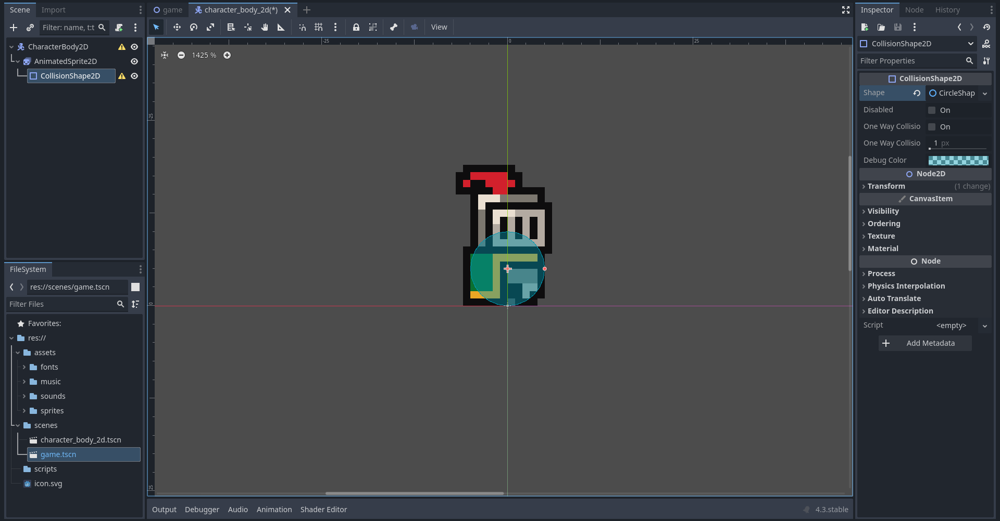
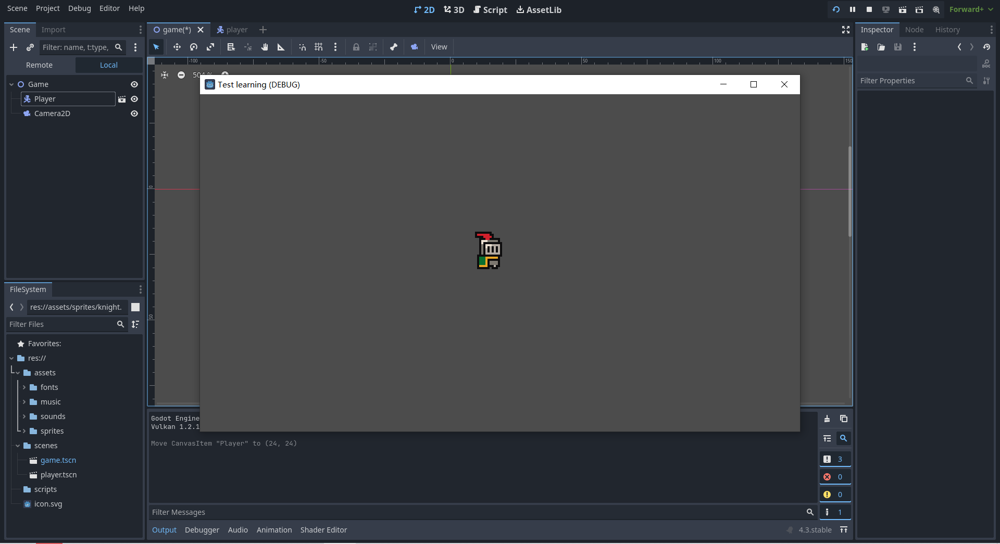

# Entry 2
##### 12/14/24

Now that I learned some basic of Godot, I needed to start actually trying to build things in the game engine using the editor. For now, I started with building a 2D game following a [youtube tutorial](https://www.youtube.com/watch?v=LOhfqjmasi0) to gain an understanding of how the game engine and editor works. To start off I need to build a character, or there won't be anything to play around with.

In Godot you have a main game branch and side branches. For example, I would save my character in another branch then add it to my main game scene. This way I want to fix something about my chracter I would be able to do it on the character branch.

In Godot, to create anything you need to first add nodes. To start creating a character I have to first add a node called `CharacterBody2D`. After that I need to add a node called `AnimatedSprite2D` or else the character won't be moving. Then I have to pick frames from a spritesheet so the game engine will run a few frames to animate.

For now I only added idle animation because I don't know how to make characters move yet. Now, I can press the play button and see the character move. I can change how fast it moves by increasing the Frame Per Second and I can make it run automatically at the start of the game.

After adding the `AnimatedSprite2D` node I realized that there's an error with the `CharacterBody2D` node because there's no hitbox on the character. Then I added a `CollisionBody2D` node. Basically this acts as a hitbox so that the character can actually touch/interact with objects.

In the image above, the blue circle surrounding the sprite will be the sprite's collision range, basically if you are walking on a map the circle has to touch the ground and if this isn't a thing, the character will just fall through the floor.

Now that the player sprite is complete I can just drag the file into the game scene and now there's a character. However, I can't actually run the game yet because there's no camera, basically the viewport (the screen you will see when you play the game). To do this I need to add a new node called `Camera2D`. After adding the node I noticed a large view port around the player and I think it is way too large. So I learned to use the zoom feature in the inspector for `Camera2D`. The default was 1 by 1, so I tried to make it 4 by 4. I realized that as the number goes up the view port gets smaller. Now I can run my game and see that there's a sprite playing an idle animation. However, the sprite just falls down, out of the camera and disappear because there's no ground for the character to land on (No object to collide with).

As you can see in the image, the character is basically standing on void, and there's nothing for it to move on.

So my goal for this winter break is to learn how to build a world, using tiles and create a map for the player to move on. After that I want to learn some scripts, like code my character movements. I know that Godot gives template scripts but I need to understand them. I want to create key inputs and make it so that my character moves. If I finished all of that, I might try to learn extra stuff like dying and picking up items in game.

Currently, I am on step 2 and 3 of the Engineer Design Process. I am still researching on how to create my game and I am brainstorming possible things/function I can learn/add to my game. During the winter break, I need to plan on what to learn to utilize my time and actually tinker with the Godot game engine/editor and become fluent at using it.

The skills I used during this period of time are **How to Google**, **How to learn** and **Problem Decomposition**. I used how to google to help me find documentations and sources like youtube tutorials for me to learn Godot and I had to make sure those resources will be useful to me and its something I can understand. I used how to learn because I had to learn on my own, there's limited resources for me to utilize to learn Godot and I had to learn Godot on my own. I never used a game engine like Godot before so it is fun to learn it on my own just by following tutorials. I also used problem decomposition to breakdown my project into parts so I know what I should learn first and how I can structure my game step by step.

[Previous](entry01.md) | [Next](entry03.md)

[Home](../README.md)