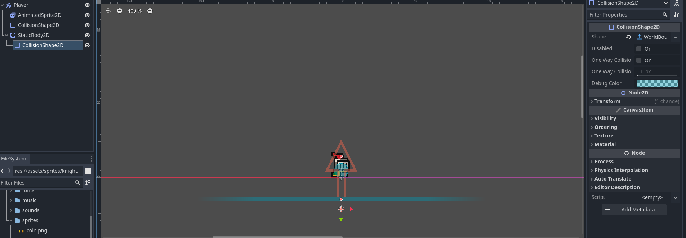
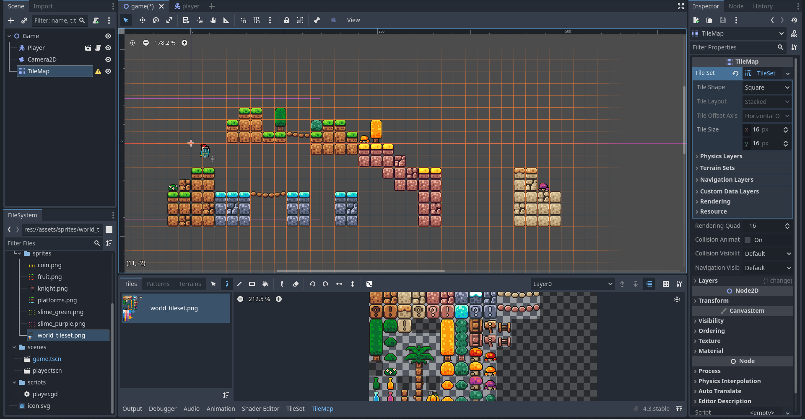

# Entry 3
##### 02/03/25

During the winter break I learned map building and player movement. After creating a player sprite I need a place to place the character and make it move. So I learned how to build a simple 2D world for the player to move on.

To start off, I learned some nodes to create a basic invisible platform. The first node I added was the `StaticBody2D`. This node is another physics body and it is used for non-moving objects which is why it is called static body. However, this static body also needs a `CollisionShape2D` in order to function properly. This time I set the collision shape as a `WorldBoundaryShape2D`. This way the character will have a ground to stand on that extends infinitely in the direction you want.

After this I attached a script to the player, the basic movement script which allows you to move with arrow keys and jump with the space bar.

After learning about static body and collisionshape I tried to learn how to build a 2D map in Godot. First I have to import a tile set. Then, I have to create a tile map node and add the tile set to it, after that, it will be just like what I did with the sprite sheet. I can select tiles and add it onto my project. The good thing about Godot is that after you import the tile set and create the tile map node, you will see grids on your project and you can select the tile you want and add it on to your project by clicking on each grid.

This was me opening the tile map and I can use paint mode to paint the block I select onto the project. You use left click to paint and right click to delete.

Then this is my basic finished tile map.

However, I realized a problem very soon. When I start playing the game, my character falls right through the map and this means I need to make it a physical ground.

Thankfully in the properties of the `TileMap` node, I can enable physics layer. Then I need to go to paint on the tileset, now I have to select a different paint property which is the physics paint property. Then I just need to select the block and give it physics. After that I just select different blocks and give it physics.

Now that I painted the physics I can finally play the game and have my character move and jump on a map.

After learning most of the basic in 2D like creating a player and building a map and providing movement to the player I think it is time for me to actually move on to 3D.

My freedom project was to create a 3D game so I think I will learn how to build a 3D game next. I will learn new 3D nodes and making static body and collision shapes on 3D. I will also learn how to make a 3D player. All of this can be done by adding nodes to the game so I will try to create a 3D character on a platform next.

Currently, I am on step 3 and 4 of the Engineer Design Process. I finished brainstorming most of my project and now I learned a lot of the basics so I think it is time to start planning what to do and aim to create a MVP (minimum viable product) soon. I need to understand what nodes to use to create my 3D game and learn the nodes I am going to use.

The skills I used during this period of time are **problem deomposition**, **how to google** and **consideration**. I used the skill problem decomposition because I had to break down my game into nodes and understand where to start and build my game. Then, I used the skill how to google to find information I need, like the 3D nodes I will be using. I had to find them online and learn it or I will be clueless when creating my game. I also used the skill consideration to pick the nodes I will be using for my game I have to consider what I need to create a MVP and which nodes I need to use out of all the nodes Godot have.

[Previous](entry02.md) | [Next](entry04.md)

[Home](../README.md)