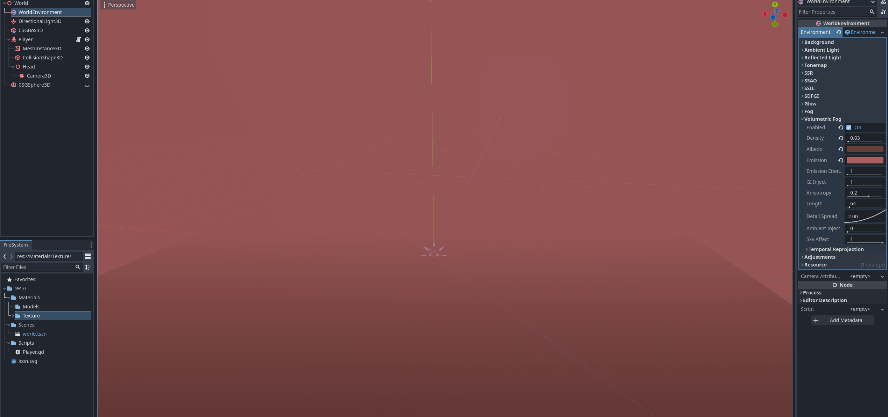

# Entry 4
##### 3/16/25

After learning a bit of 2D game design. I started to move on to what I really needed to do which is creating a 3D shooter game. To start off I learned how to create a base plate in 3D. I used a `CSGBox3D` node to create my ground. It is really easy to make a base plate in Godot, I can drag the node to change the size of my ground and I have many things I can edit in the inspector section. There are other shapes too like CSGSphere and CSGCylinder. Then I can actually use them to create many things by putting these shapes together.


As you can see from the image I added textures to the box by first creating a new standard material and then moving to the albedo section and uploading an image then the ground starts to look like something that's not just a plain white base plate.

Then I started researching into how to make a character in 3D. It turned out to be similar to creating a character in 2D. I would use a `CharacterBody3D`, `MeshInstance3D` and `CollisionShape3D`. First, I attached the MeshInstance node to the CharacterBody node, then I set its mesh to a capsule shape which is similar to a human height. After that I have to attach a CollsionShape node to the CharacterBody to make the character collideable with other objects. Then I realized a problem, how would I make the character first person? So I went to look at the nodes that Godot has to offer and I found a `Camera3D` node which acts as the point of view. However, to make it first person you have to attach the camera node to a `Node3D`. Then attach the `Node3D` to the CharacterBody. Then drag `Node3D` up so it acts as a head for my character. Then I attached a basic movement script to the character and now I have a moving character.


After I am done with the player I realized that the map is a bit blend and has nothing, so I tried to create an environment. First, I started by creating a `CSGSphere` node as the moon and then making it big so that the shadow can cover the map, then I went to the geometry section and created a material then I changed it's albedo color. After that I added a `WorldEnvironment` and `DirectionalLight3D` node. For the world environment node I went to its environment and created a new one, then I went to the volumetric fog section to create my environment, in the volumetric fog section I changed the albedo and emission to compliment each other to create a good looking fog. Then I went to the directional light node to create a light blue color to compliment the fog. Now I have a foggy environment.



After this I went back to my character and tried to add sprint and remove the cursor when I am in game because in a fps game you shouldn't see your cursor. So after looking through Godot documentations for codes and some youtube tutorial I went to coding in the movement script of the character. To create a sprint option is really easy. First I just need to add a key in the godot input map as the sprint key then I create a new variable for sprint speed and change the speed to the sprint speed whenever I press my sprint key.

```js
var speed
const WALK_SPEED = 5.0
const SPRINT_SPEED = 8.0
const JUMP_VELOCITY = 4.8
const SENSITIVITY = 0.004

func _physics_process(delta):
	# Add the gravity.
	if not is_on_floor():
		velocity.y -= gravity * delta

	# Handle Jump.
	if Input.is_action_just_pressed("jump") and is_on_floor():
		velocity.y = JUMP_VELOCITY

	# Handle Sprint.
	if Input.is_action_pressed("sprint"):
		speed = SPRINT_SPEED
	else:
		speed = WALK_SPEED
```
This code basically uses if and else statement in the physic process function to change the vertical and horizontal velocity (x or y). Like if I press the sprint key which is shift then my speed will become sprint speed and if I press jump and I am on the floor then my vertical velocity will go up causing my chracter to jump or move upwards.


Currently, I am on step 4 and 5 of the Engineer Design Process. I finished planing out my game and I have a MVP (minimum viable product) in mind, like I need to have player, map, shooting mechanic and enemies. So, now I can start creating my game and so far I already got the player and map done.


The skills I used during this period of time are **debugging**, **how to google** and **embracing failures**. I used all these skills at the same time because when I was coding the player movement script I often run into errors and I have to go back to googling my errors and what I am missing because I am not that good with GDScript. However, I didn't let these errors stop me, I continued researching and watching tutorials until I got my code to work and have a functional character to play with.


[Previous](entry03.md) | [Next](entry05.md)

[Home](../README.md)