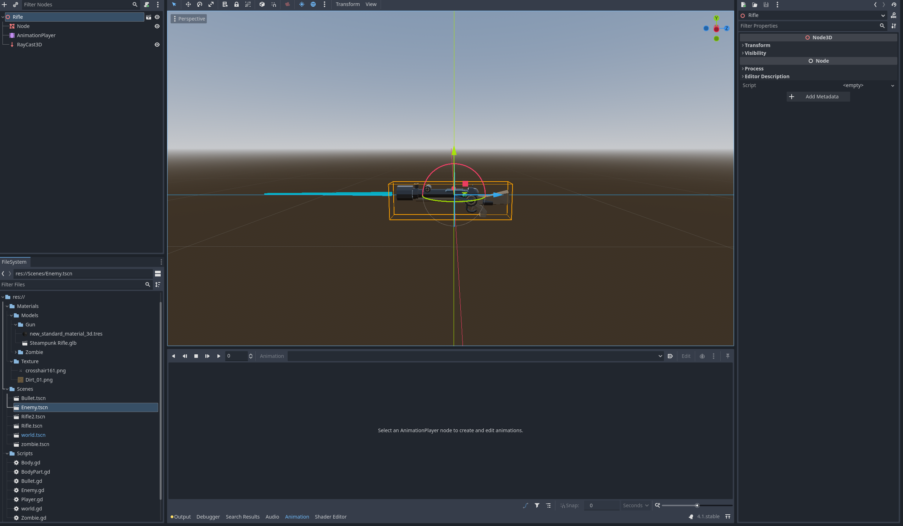
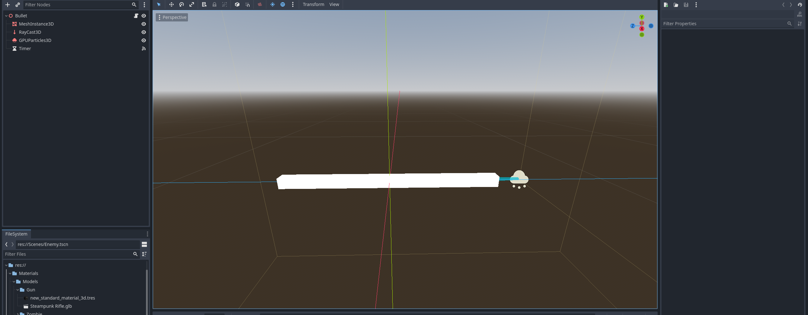

# Entry 5
##### 4/27/25

After learning most of the basics, I have to start working to create a MVP (Minimum Viable Product). Right now, I have a character and a map. So I need to make a gun and shoot. First of all, I had to import a gun model. Then, I make it as a scene and start creating a gun shooting animation by adding a new `AnimationPlayer` node. Then I just add a new propery track then insert new keys to create a gun moving animation after I shoot. Then I save the gun as a scene and drag it to my main screen and now I have a gun.


After making a gun, I need to make the bullet as well. So I just create a new scene and add a mesh instance node as a box and add `raycast` and `GPUParticle` node to it as well. This is what it needs to create a simple bullet that can collide with objects and create particles upon impact. However, I need to add code to it so that the enemy will take damage from the bullet.
```java
extends Node3D


const SPEED = 40.0

@onready var mesh = $MeshInstance3D
@onready var ray = $RayCast3D
@onready var particles = $GPUParticles3D

# Called when the node enters the scene tree for the first time.
func _ready():
	pass # Replace with function body.


# Called every frame. 'delta' is the elapsed time since the previous frame.
func _process(delta):
	position += transform.basis * Vector3(0, 0, -SPEED) * delta
	if ray.is_colliding():
		mesh.visible = false
		particles.emitting = true
		ray.enabled = false
		if ray.get_collider().is_in_group("enemies"):
			ray.get_collider().hit()
		await get_tree().create_timer(1.0).timeout
		queue_free()

func _on_timer_timeout():
	queue_free()
```


This code basically sends out the bullet and detects if the ray(bullet) collides with anything and if it collides with an "enemy" then it will send a hit signal to the body part.

```js
extends CollisionShape3D

@export var damage := 1

signal body_part_hit(dam)

# Called when the node enters the scene tree for the first time.
func _ready():
	pass # Replace with function body.


# Called every frame. 'delta' is the elapsed time since the previous frame.
func _process(_delta):
	pass


func hit():
	emit_signal("body_part_hit", damage)

```
This code basically creates a damage variable and signal that a enemy is hit since the bullet collided with the collision shape that the enemy has, then it sends the signal saying that the body is hit and it takes damage.

Now that I have a gun that can shoot, I need to create enemies for me to kill.

The enemy was really easy to make because in order to finish the MVP I decided to do something easy for the enemy. I just created a cylinder mesh, made it red and add a collsion shape to it. The code above is connected to the collision shape of the enemy. Then I learned about pathfinding for enemies, by adding a navigation agent node to the enemy then put my environment under a navigation region so that the enemy can find me anywhere on the map.

Then I added a script to the enemy, which allows it to move toward the player and receive signal that it is getting hit. Obivously, the enemy can hit the player as well but the player can't die because I didn't add hp to the player yet.


```js
extends CharacterBody3D

@onready var nav_agent = $NavigationAgent3D

var SPEED = 5.0
const ATTACK_RANGE = 2.0
var player = null
var health = 6

@export var player_path := "/root/World/Map/Player"

@export var damage := 1

signal body_part_hit(dam)

func _ready():
	player = get_node(player_path)

func _physics_process(delta):
	var current_location = global_transform.origin
	var next_location = nav_agent.get_next_path_position()
	var new_velocity = (next_location - current_location).normalized() * SPEED

	velocity = velocity.move_toward(new_velocity, 0.25)
	move_and_slide()

func update_target_location(target_location):
	nav_agent.target_position = target_location


func _target_in_range():
	return global_position.distance_to(player.global_position) < ATTACK_RANGE

func _on_navigation_agent_3d_target_reached():
	if global_position.distance_to(player.global_position) < ATTACK_RANGE + 1.0 :
		var dir = global_position.direction_to(player.global_position)
		player.hit(dir)

func hit():
	_on_collision_shape_3d_body_part_hit(1)


func _on_collision_shape_3d_body_part_hit(dam):
	health -= dam
	if health <= 0:
		var world = get_tree().get_root().get_node("World")
		if world and world.has_method("add_score"):
			world.add_score(1)
		queue_free()

```
This code allows the enemy to move toward the player and receive damage when it gets hit. When the health reaches 0 the enemy just disappears due to the `queue_free()` funtion. I also added a score increase system so whenever an enemy dies the score increases by 1.

Now I have a MVP, that includes a player, shooting mechanic and enemies.

Currently, I am on step 5 and 6 of the **Engineer Design Process**. I created the protype (MVP) by adding all the elements that's needed for a shooter game. Then I need to test this prototype and see if it works properly. I need to see if there are bugs and fix it for my final product.

The skills I used during this period of time are **time management**, **how to google** and **debugging**. I had to finish my MVP during the spring break so I had to schedule everything and make sure that I can create a MVP before the end of the break, I need to prioritize on what I need to make first so that my MVP is finished. I needed to google a lot of things, like how to create enemy pathfinding and how to create a gun that can shoot bullets. However, even whem I am following tutorials or reading documentations I run into bugs so I have to try and fix them, like I had to connect some function to certain nodes so that it actually signals that the enemy is taking damage.

[Previous](entry04.md) | [Next](entry06.md)

[Home](../README.md)