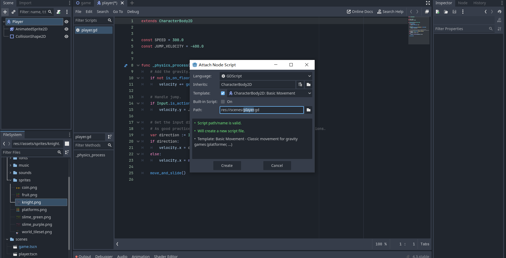
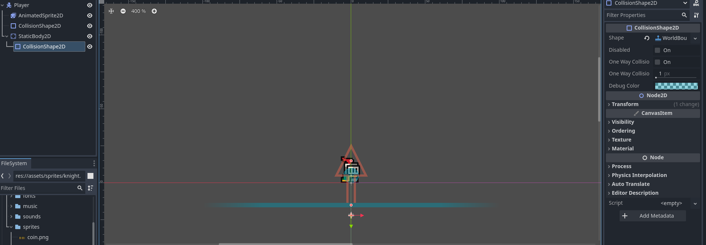
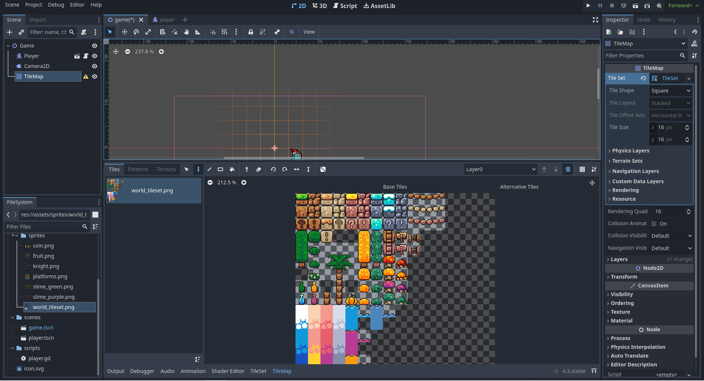
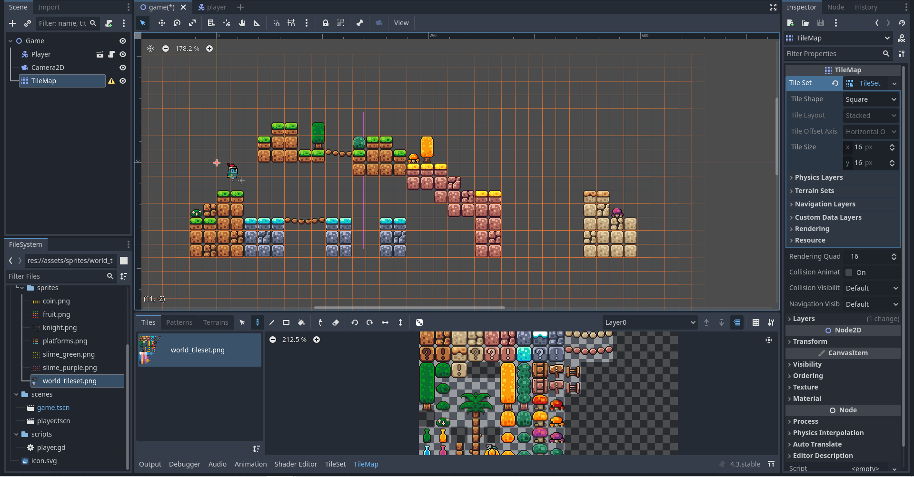
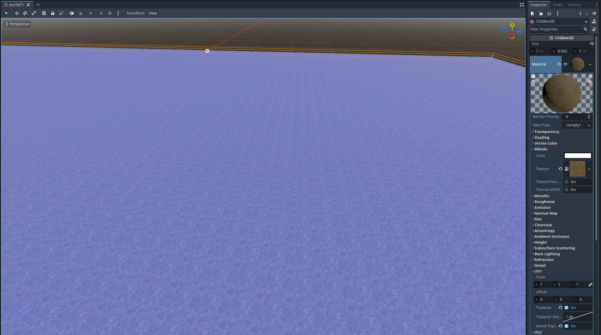
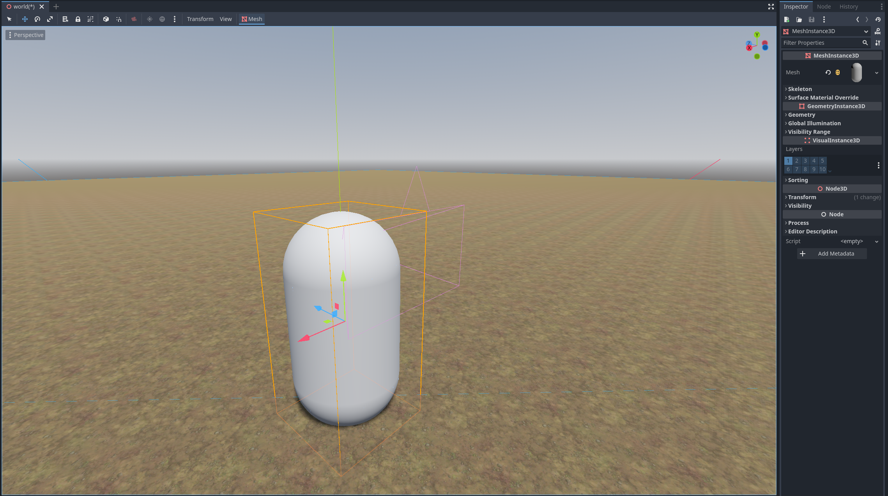
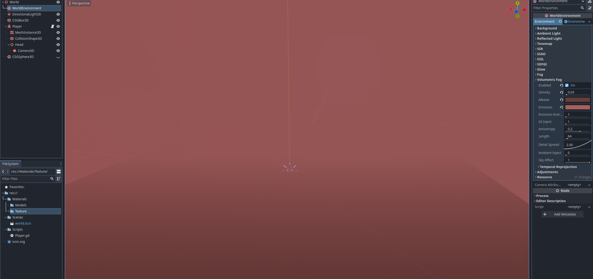
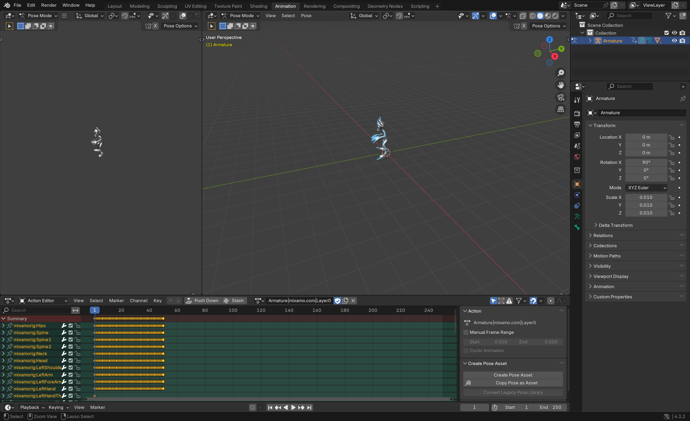
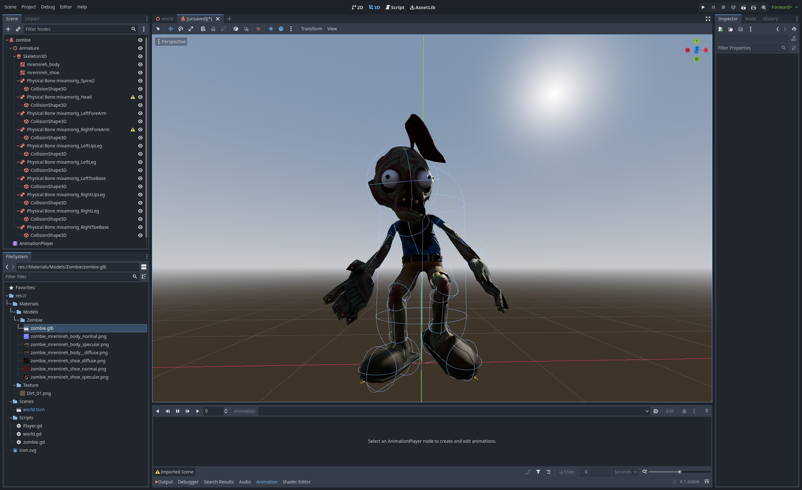
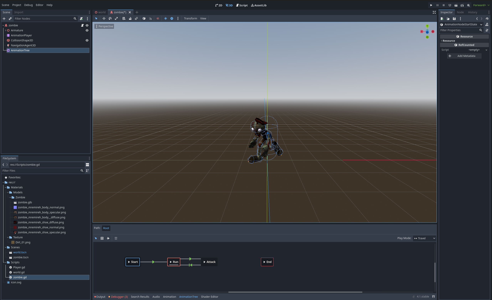

# Tool Learning Log

## Tool: **Godot**

## Project: **Maze Game**

---

### 10/20/24:
I started my journey of learning Godot by watching this [Youtube Video](https://www.youtube.com/watch?v=LOhfqjmasi0). Godot is different from the coding tools I used before, I used to just add the CDN into my codespace and work on github. Godot is different however because you have to download their game engine and code in there. I followed the tutorial and downloaded the game engine. Then I started my first project by creating a file inside my godot folder. Now that I am inside the editor, I started to explore around. There are 3 type of scenes and it is the basic to start your project. 2D Scene, 3D Scene and User Interface.

### 10/27/24:
Today I learned how to import assets to Godot. It is really simple and all you have to do is download assets and then just click and drag into godot's files. Then I learned how Godot works and we use nodes which is what you use in godot to make anything. Then you will use scenes to build nodes together into reusable parts. Scenes makes it easy to focus on building one part of the game at a time. We can put scenes inside of scenes which is called nesting.

It is like a scene tree:
Game (Root)
* Player
    * graphics
    * collider
* Enemy

### 11/10/24:
Today I decided to learn how to create a player/character/sprite in Godot.

To start I first added a new node called `CharacterBody2D` and this is what I am going to be testing with today. However with just `CharacterBody2D` won't get me anywhere because it won't do anything if there's no characters. So, I added another node called `AnimatedSprite2D`. Then I can use the inspector bar on the right of the scene to see the properties of the node and change them. Then I added sprite frames from a sprite sheet to `AnimatedSprite2D`. Sprite frames can be added by uploading a spread sheet then I have to set it into grids and click the grids I want for a specific set of animations and then the animation will be added. Now I can press play and there will be an animation playing.

### 11/23/24
Today I continued off of what I learned last time. Last time I created the idle animation for a character. After finishing the node `AnimatedSprite2D` I realized that there's an error on the `CharacterBody2D` which is saying that the node has no shape so the object can't collide with anything. A `CharacterBody 2D` is a physics node and a physics node needs a defined shape node to work with.

Then I added a `CollisionShape2D` node and went to the inspector and added a circle shape . The circle shape is basically the hitbox of the character and that will be how the chracter collides with objects. Now I save the player and drag it back to the main game scene.

### 12/7/24
After I made a player in my game, I need to add a camera to control what is being shown. I added a new node called `Camera2D` after adding the node I noticed a large view port around the player and I think it is way too large. So I learned to use the zoom feature in the inspector for `Camera2D`. The default was 1 by 1, so I tried to make it 4 by 4. I realized that as the number goes up the view port gets smaller. Now I can run my game and see that there's a sprite playing an idle animation.

### 12/31/24
Today I added a script for player movement in godot and I did it using the base template script that godot provides. When I added the physics and run the game, the character just falls down because there's no ground for it to collide with.

Then I learned to add a new node called `StaticBody2D`. This node is another physics body and it is used for non-moving objects that's why it is called static body. However, this body also needs a `CollisionShape2D` in order to function properly. This time I set the collision shape as a `WorldBoundaryShape2D`. This way the character will have a ground to stand on that extends infinitely in the direction you want.

Now that my character have a platform to move on I can use my arrow keys to control and my character and move it around.

### 1/12/25
Today I learned how to build map on Godot. To create a map in 2D I would use tiles and it is similar to sprite sheets. I would use a tile set and just select tiles and put it in grids to make a map.

To do this I added a `TileMap` node and added a tile set.

First I uploaded a tile set image into the `TileSet` section at the bottom of the image and now I have a tile map and I can start painting with it by using the paint tool in Godot.

You use left click to paint and right click to delete.

The image is the current basic tile map that I painted.

### 3/1/25
Today, I started learning about 3D in Godot.

First I learned how to make a platform by using `CSGBox3D` node. In Godot you can edit a csg box and stretch it however you make, so to start off I made a 100 by 100 platform on Godot using csgbox. The csgbox has built in physics and is very easy to use, I can use it to make many shapes and structures because I can strtech it and turn it into whatever I want. There are other shapes too like CSGSphere and CSGCylinder.

I added textures to the box by first creating a new standard material and then moving to the albedo section and uploading an image then the ground starts to look like something that's not just a white base plate.

After that I moved on to create a character in 3D. To make a character in 3D you use the node `CharacterBody3D`. This node is very similar to the `CharacterBody2D` node. The first thing is to attach a `MeshInstance3D` node to the `CharacterBody3D` node and set its mesh to a capsule shape which is similar to a human height. After that I have to add a collision shape to it to make the character collideable. Then I created a `Node3D` and attached a `Camera3D` node to it, then I dragged the node3D to the head of a capsule to create a first person feel. Then I atached a basic movement script that Godot provides and now I have a moving first person character.

### 3/8/25
After learning how to make a character I moved on to learning a bit of map building.

First, I started by creating a `CSGSphere` node as the moon and then making it big, then I went to the geometry section and created a material then I changed it's albedo color. After that I added a `WorldEnvironment` and `DirectionalLight3D` node. For the world environment node I went to its environment and created a new one, then I went to the volumetric fog section to create my environment, in the volumetric fog section I changed the albedo and emission to compliment each other to create a good looking fog. Then I went to the directional light node to create a light blue color to compliment the fog.

## 3/23/25
Today I learned how to import 3D models to Godot. The first thing I wanted to import was enemies with animation. After watching a [youtube video](https://www.youtube.com/watch?v=iV710Vm5qm0), I learned how to import from Mixamo a website full of 3D character and animation from Adobe. I just select a character then switch to the animation section and download some animations I like, I made sure to download the file as fbx files so I can import them to blender and put the animations together.

After I put the animations together I exported the file as a glb file because it is easy to work with in Godot. After I imported the zombie model, I created a new inherited scene and changed it root node to `CharacterBody3D`. Then I created a collision shape of a capsule and put it on to the zombie to act as its hitbox. Then I clicked on the `Skeleton3D` node that came with the import and created a physical skeleton that tries to imitate the model but it wasn't really enough at the end. So I had to create my own collision shapes and put it onto the zombie.

## 3/30/25
Today I learned about animation tree which is a way to connect animations from an animation player. First I have to assign an animation player to the animation tree. Then I will make the animation tree an AnimationNodeStateMachine. Then I just need to create nodes and add the run, attack and standup animation on to the state machine, then I add transitions from one animation to another so that way the zombie will start moving. Then I assign a root motion in the hips of the zombie to make sure that the zombie moves only with code.

<!--
* Links you used today (websites, videos, etc)
* Things you tried, progress you made, etc
* Challenges, a-ha moments, etc
* Questions you still have
* What you're going to try next
-->
